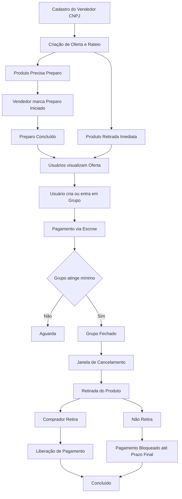

# Rateei! 🛒

**Plataforma de compras coletivas que conecta vendedores e consumidores através de grupos de compra com rateio inteligente.**

## 🎯 Sobre o Projeto

O Rateei é uma solução inovadora que permite aos vendedores criar ofertas com rateio de custos, enquanto consumidores se organizam em grupos para obter melhores preços através do poder de compra coletiva.

### Como Funciona

## 🚀 Começando

### Para Desenvolvedores

1. **Clone os repositórios:**
   - Backend API
   - Frontend Web
   - Mobile App
   - Documentation

2. **Configure o ambiente de desenvolvimento:**
   - Instale as dependências necessárias conforme documentação
   - Configure as variáveis de ambiente seguindo o .env.example
   - Execute os serviços na ordem:
     1. API/Backend
     2. Web Frontend 
     3. Mobile App

3. **Documentação técnica:**
   - Consulte a documentação completa para detalhes da arquitetura
   - APIs documentadas com OpenAPI/Swagger
   - Siga os guias de contribuição em cada repositório

### Para Usuários

- **Vendedores:** Cadastre-se com CNPJ e comece a criar ofertas com rateio
- **Compradores:** Encontre ofertas, forme grupos e economize nas compras

## 🛡️ Segurança e Pagamentos

- Sistema de **escrow** para proteção de pagamentos
- Validação de CNPJ para vendedores
- Janela de cancelamento para proteção do consumidor
- Políticas de reembolso automatizadas

## 🤝 Contribuindo

Cada repositório possui suas próprias diretrizes de contribuição. Consulte o arquivo `CONTRIBUTING.md` em cada projeto específico.

## 📋 Roadmap

- [ ] MVP com funcionalidades básicas
- [ ] Sistema de avaliações
- [ ] Integração com múltiplos gateways de pagamento
- [ ] App mobile nativo
- [ ] Dashboard analytics para vendedores
- [ ] Sistema de cupons e promoções

## 📞 Contato

- **Email:** contato@rateei.com.br
- **Website:** https://rateei.com.br
- **Discord:** [Comunidade Rateei](link-discord)

## 📄 Licença

Este projeto está sob a licença The Unlicensed. Veja o arquivo [LICENSE](LICENSE) para mais detalhes.

---

**Rateei** - Transformando a forma como compramos juntos 🚀